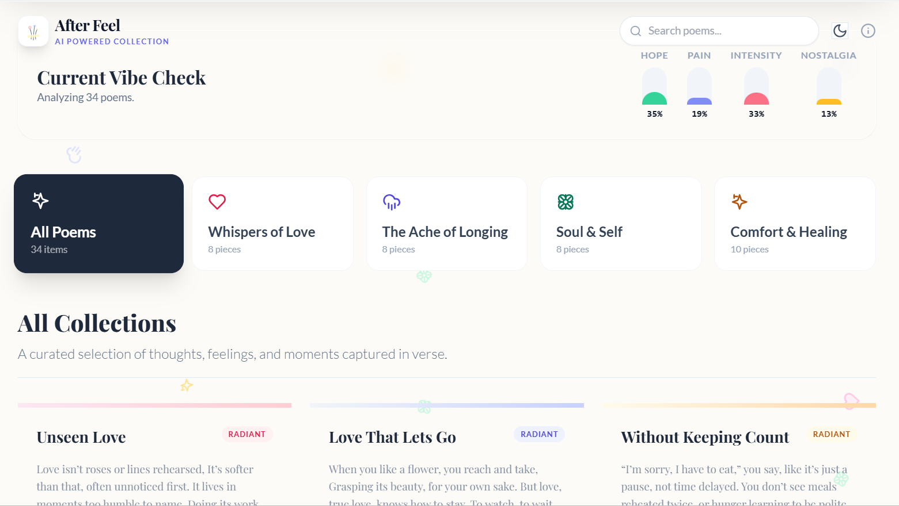

# Afterfeel | AI-Powered Poetry Experience
[](https://after-feel-poetry-collection.vercel.app/)
> *"Love isn’t proven when you beg or plead, It’s shown before you even speak."*

**Afterfeel** is an immersive, interactive poetry portfolio designed to bridge the gap between literature and technology. Built as a digital sanctuary for the poetry of **Avni Joshi**, this application utilizes browser-based Artificial Intelligence to analyze the emotional weight of words in real-time, offering readers a visual representation of the feelings behind the verses.


---

## 📖 About The Project



Afterfeel is more than just a static blog...

Afterfeel is more than just a static blog; it is a **reactive web experience**. The core philosophy was to create a "living" interface where the UI adapts to the content.

The application features a **"Zero-Build" architecture**, meaning it runs entirely in the browser using React and Tailwind CSS via CDNs. This design choice highlights mastery over fundamental web technologies without reliance on heavy build tools like Webpack or Node.js.

### Key Objectives
* **Emotional Visualization:** Translating abstract feelings (Longing, Hope, Intensity) into concrete data points.
* **Accessibility:** Ensuring poetry is accessible through visual, text, and auditory mediums.
* **Aesthetic Minimalism:** Implementing "Glassmorphism" design trends to create a distraction-free reading environment.

---

## ✨ Core Features

### 🧠 AI & Sentiment Analysis
* **Real-time Vibe Check:** A custom Natural Language Processing (NLP) algorithm runs locally in the browser to tokenize poem text.
* **Weighted Scoring System:** The engine evaluates words against a custom dictionary to calculate four key metrics:
    * 🟢 **Hope:** (Keywords: *sun, light, bloom, steady*)
    * 🔵 **Pain:** (Keywords: *rain, torn, dark, ache*)
    * 🔴 **Intensity:** (Keywords: *burn, wild, scream, fire*)
    * 🟡 **Nostalgia:** (Keywords: *miss, time, memory, ghost*)
* **Dynamic Visualization:** A pie chart and mood badges automatically generate based on the calculated scores.

### 🎨 Immersive UI/UX
* **Floating Particle System:** A background animation layer featuring floating hearts, sparkles, and clouds that drift across the screen.
* **Glassmorphism Cards:** UI components utilize backdrop filters to create a frosted glass effect, adding depth and modernity.
* **Theme Persistence:** Fully functional Dark Mode that respects system preferences and saves user choice to LocalStorage.
* **Responsive Layout:** A masonry-style grid layout that adapts seamlessly from mobile screens to desktop displays.

### 🔊 Accessibility & Interaction
* **Text-to-Speech Engine:** Integrated `SpeechSynthesis` API allows users to listen to poems read aloud in various browser-supported voices.
* **"Like" System:** Users can "heart" their favorite poems, with preferences persisted locally in the browser.
* **Search & Filter:** Instant filtering by Category (Love, Longing, Self, Comfort), Mood, or Keyword search.
---

## 🛠️ Technical Architecture

This project demonstrates a sophisticated use of "No-Build" React. It proves that complex, interactive applications can be built with a lightweight footprint.

| Component | Technology | Description |
| :--- | :--- | :--- |
| **Frontend Framework** | **React 18** | Used via UMD CDN for component-based state management. |
| **Styling Engine** | **Tailwind CSS** | Used via Script CDN for utility-first styling. |
| **Compiler** | **Babel** | In-browser transpilation of JSX syntax. |
| **Icons** | **Lucide / SVG** | Custom SVG paths implemented as reusable React components. |
| **Data Storage** | **LocalStorage** | Persists "Liked" poems and Theme preferences. |
### The "Sentiment Engine" Logic
The application utilizes a deterministic dictionary-based approach for sentiment analysis. Words are matched against predefined emotional categories, and a "Mood" is assigned based on the dominant score.

```javascript
// Simplified Logic Snippet
const analyzePoem = (text) => {
  // Tokenize and match against weighted dictionaries
  // Calculate aggregate scores for Positivity, Negativity, Intensity
  // Return chart data and a definitive "Mood" label
};
```
## 🧠 The Sentiment Engine Logic

The core of **After-Feel** is a deterministic, dictionary-based analysis engine designed to process poetic text in real-time. Instead of heavy machine learning dependencies, it uses a high-performance three-stage pipeline to interpret the "mood" behind the verses.

### 🔄 The Processing Pipeline

1. **Normalization & Tokenization** The engine prepares raw text by converting all input to lowercase and stripping punctuation. This ensures that words like "Glimmer" and "glimmer!" are processed as the same emotional token.

2. **Weighted Scoring** Each token is cross-referenced against primary datasets to calculate an aggregate emotional weight:
   * **Positivity Dictionary:** Identifies uplifting or ethereal vocabulary.
   * **Negativity Dictionary:** Detects somber or hollow vocabulary.
   * **Intensity Modifiers:** Words like "deeply" or "very" apply a **1.5x multiplier** to the final scores.

3. **Mood Mapping & UI Synergy** The final dominant score triggers a dynamic shift in the application's visual theme:

| Sentiment Balance | Resulting Mood | UI Visual Theme |
| :--- | :--- | :--- |
| **High Positivity** | ☀️ **Radiant** | Golden / Warm Tones |
| **High Negativity** | 🌑 **Somber** | Midnight / Cool Tones |
| **High Intensity** | 🌋 **Vivid** | High Contrast / Deep Tones |

---

## 🚀 How to Run

Since this project uses a **No-Build** React architecture, you can run it instantly without any local installations:

1. **Clone** the repository: `git clone https://github.com/ananyajoshi-cseai/after-feel`
2. **Open** `index.html` in your favorite browser.
3. **Experience** the poetry—the CDNs handle all libraries automatically.
## 📂 Project Structure

To maintain simplicity and portability, the entire application lives within a single, self-contained architecture:

```text
Afterfeel/
├── index.html        # The core application file containing:
│                     # - React Components (App, FullPoemView, Modal)
│                     # - Tailwind Configuration
│                     # - Poem Data (JSON Array)
│                     # - NLP Logic
├── README.md         # Project documentation
└── .gitignore        # Git configuration

```
---

## 📝 License & Copyright

**Code License:** The source code (React logic, UI architecture, and NLP algorithms) is licensed under the **MIT License**. You are free to use, modify, and distribute the code for your own projects.

**Content Copyright:** ⚠️ **IMPORTANT:** The poetry content (text, titles, and creative writing) is **Copyright © Avni Joshi**. All rights reserved. The poems may not be reproduced, distributed, or used for commercial purposes without explicit written permission from the author.

---

<div align="center">
  <p>Built with 💙 by <a href="https://github.com/yourusername">Ananya Joshi</a></p>
  <p><i>Merging Logic with Emotion</i></p>
</div>
```
